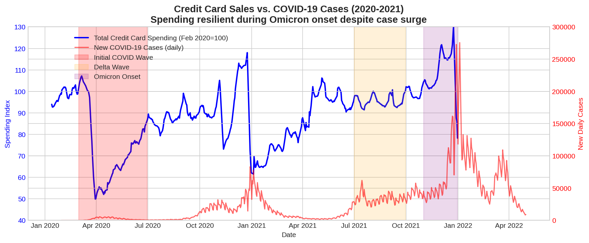
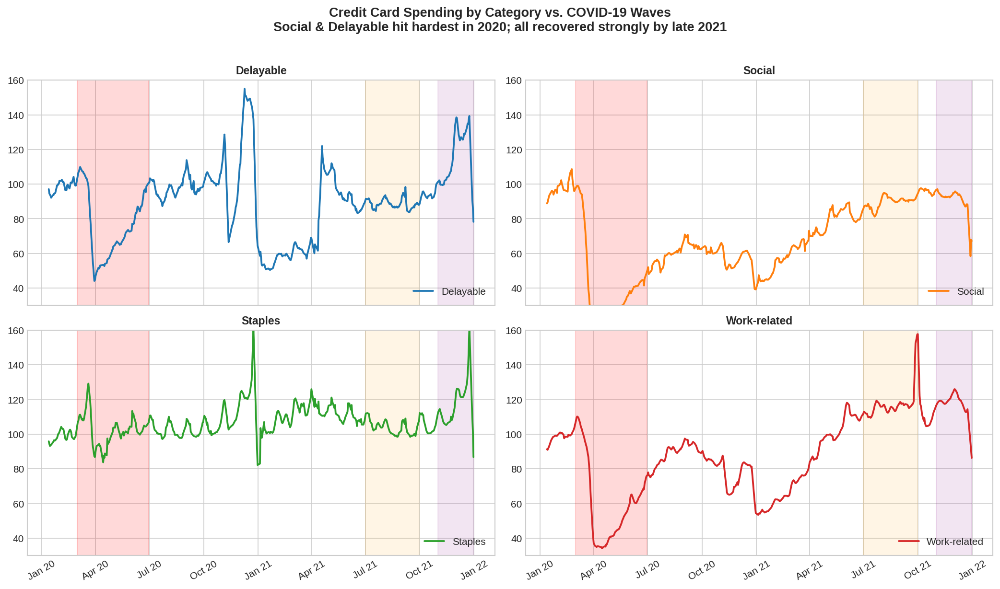
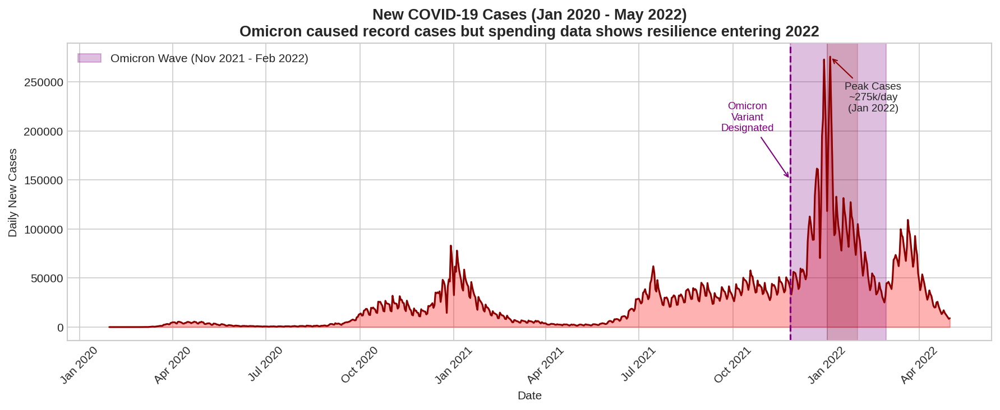
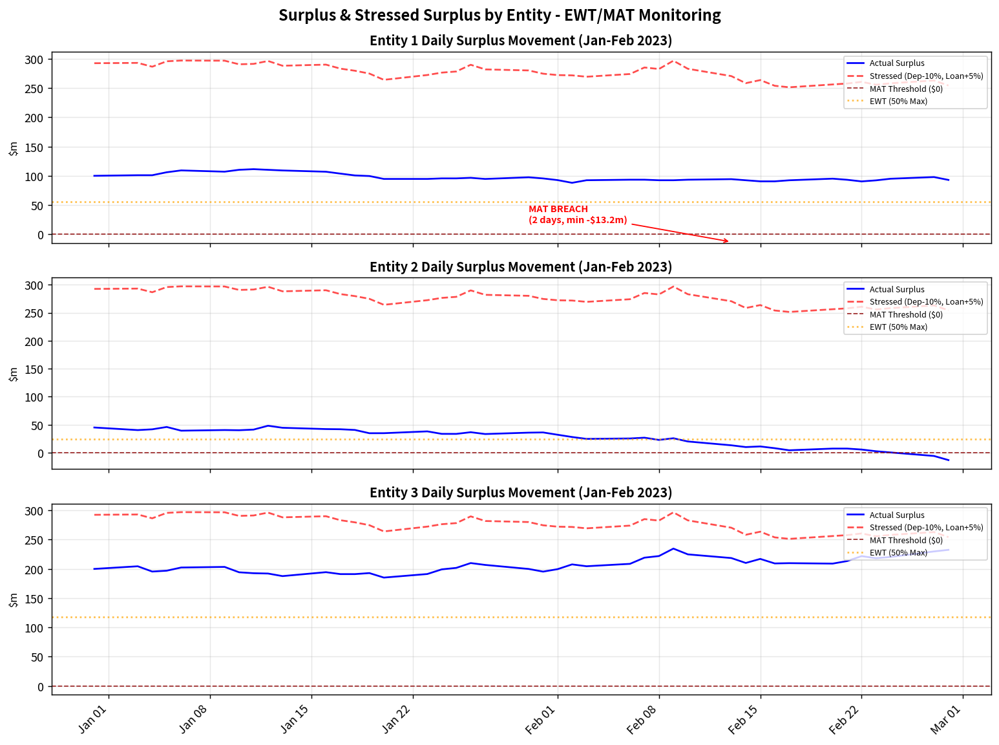

# Citi Finance Virtual Experience Simulation

**Program:** Citi Finance Virtual Experience Program — Tasks 1–4  
**Date:** May 2026  
**Core Skills:** Balance sheet trends and KPI analysis · Validation of RWA calculations · Impact of Omicron on credit card sales · Limits monitoring and deposits tracking  
**Additional Skills:** Fact-Finding · Data Analysis · Communication · Presentation · Banking Regulation · Professional Judgment · Commercial Awareness

---

## Table of Contents

1. [Program Overview](#program-overview)
2. [Task 1 — Annual Operating Plan & KPI Summary](#task-1--annual-operating-plan--kpi-summary)
3. [Task 2 — RWA Verification](#task-2--rwa-verification)
4. [Task 3 — Omicron Impact on Credit Card Sales](#task-3--omicron-impact-on-credit-card-sales)
5. [Task 4 — Limits Monitoring & Deposits Tracking](#task-4--limits-monitoring--deposits-tracking)
6. [Skills Demonstrated](#skills-demonstrated)
7. [Repository Structure](#repository-structure)
8. [Conclusion](#conclusion)

---

## Program Overview

The **Citi Finance Virtual Experience Simulation** is a practitioner-designed program that replicates four high-priority work streams from Citi's Finance function. Participants work with real-style datasets, internal templates, and regulatory frameworks to produce deliverables that mirror what a junior finance analyst would produce on the job.

The four tasks move progressively through the finance value chain:

| Task | Focus Area | Business Stakeholder |
|------|-----------|----------------------|
| 1 | Annual Operating Plan & year-end KPI reporting | Senior Management / CFO |
| 2 | Regulatory capital (RWA) verification | Risk & Compliance / Manager |
| 3 | Macro-economic impact assessment (COVID/Omicron) | Strategy & Planning |
| 4 | Liquidity risk monitoring & trigger escalation | Country Treasurer & CFO |

Each task involves ingesting raw input files (Excel worksheets, PDFs, PowerPoint draft packs), performing quantitative analysis, and producing a polished deliverable — email, slide deck, or both — suitable for a senior audience.

---

## Task 1 — Annual Operating Plan & KPI Summary

### Background

At the close of every financial year, Citi's Finance team consolidates performance data from all operating units into an **Annual Operating Plan (AOP)** briefing for senior management. This summary communicates year-over-year movements across the four key income statement lines — Revenues, Operating Expenses, Cost of Credit, and Net Income — and attributes drivers at both the group and business-unit level.

For this task, the input data comprised:
- `YE'22.xls` — Year-end 2022 financial results across ICG, PBWM, Legacy Franchises, and Corp/Other.
- `Summary from FP&A teams.docx.pdf` — Narrative context from each business unit's FP&A team.
- `Finance - Task 1 - Draft Slide Pack.pptx` — A partially completed management template to populate.

### What Was Done

The raw XLS data was cleaned, reconciled across units, and mapped to the four KPI lines. Year-over-year percentage changes were calculated, and each movement was attributed to a specific business or macro driver (e.g., rising interest rates, credit loss reserve builds, transformation programme costs). The completed KPI table was formatted into the management slide template with colour-coded indicators and concise commentary.

### Results

#### Group-Level KPI Summary (2021 Actual vs. 2022 Estimate)

| KPI | 2021 Actual | 2022 Estimate | YoY Change | Primary Driver |
|-----|-------------|---------------|------------|----------------|
| **Total Revenues** | $17,017m | $18,006m | **+6%** | Higher Net Interest Income from rate hikes; TTS and Fixed Income strength |
| **Operating Expenses** | $13,500m | $13,000m | **-4%** | Savings from legacy franchise exits partially offset by ongoing transformation costs |
| **Cost of Credit** | −$500m | +$1,845m | NM | PBWM allowance build for cards growth + deteriorating macro outlook |
| **Net Income** | $3,200m | $2,500m | **−21%** | Cost of Credit swing more than offset revenue growth |

#### Performance by Operating Unit

- **Institutional Clients Group (ICG):** Revenue grew +3% on the back of robust Fixed Income and Treasury & Trade Solutions (TTS) activity. However, Net Income fell −18% as higher Cost of Credit and increased compensation expenses eroded gains. Markets volatility drove episodic revenue swings throughout the year.
  
- **Personal Banking & Wealth Management (PBWM):** Revenues rose +5%, reflecting strong card acquisition and higher spend volumes. Despite this top-line momentum, Net Income collapsed −93% year-over-year. This was almost entirely due to a large Allowance for Credit Losses (ACL) build required as the credit card portfolio scaled rapidly and macroeconomic conditions signalled future default risk.

- **Legacy Franchises:** Completed a significant strategic turnaround — moving from a net loss of −$616m in 2021 to a small profit of +$72m in 2022 — as market exit programmes concluded and drag from non-core operations was eliminated.

- **Corp/Other:** Remained broadly stable, absorbing central transformation programme investment without material deviation from prior year.

### Key Takeaway

The 2022 results tell a tale of two dynamics: strong underlying business momentum (revenue growth, transformation progress) masked by a large and necessary credit reserve build in PBWM. The key question heading into 2023 is whether the ACL build adequately covers future losses or whether further provisions will be required.

> **Output:** `Task1_Annual_Operating_Plan/outputs/Citi_KPI_Summary_Using_Draft_Template.pptx`

---

## Task 2 — RWA Verification

### Background

Under **Basel III** and the **Federal Reserve Board (FRB) Standardized Approach**, banks must hold a minimum **Capital Adequacy Ratio (CAR)** of 10.5% (including the capital conservation buffer). This ratio is computed as Total Capital divided by Risk-Weighted Assets (RWA), where each asset class is multiplied by a prescribed risk weight reflecting its credit risk.

In this task, four operating units (A, B, C, D) each submitted their own RWA calculations and resulting CAR figures. The Finance team was asked to independently verify these calculations against the FRB standardized risk weight schedule and report any discrepancies to management.

Input files included:
- `RWA Info from Operating Units.xlsx` — Each unit's self-reported asset balances, risk weights used, and CAR.
- `Risk-Weighted Asset Calculation Methodology.docx.pdf` — FRB standardized methodology documentation.
- `Task 2-Template email.docx` — Template for the manager escalation email.

### What Was Done

Each unit's asset positions were extracted from the spreadsheet and recalculated from scratch using the correct FRB risk weights. Particular attention was paid to the "Loans for Cards" category, which carries a **100% risk weight** under FRB standardized rules — a category multiple units had mis-weighted. Recalculated RWAs were used to derive the correct CAR for each unit, then compared against reported figures.

### Risk Weights Applied (FRB Standardized Approach)

| Asset Class | Correct Risk Weight | Common Error Observed |
|-------------|--------------------|-----------------------|
| Loans for Cards | **100%** | Units used 25% |
| Consumer Mortgages | **55%** | Generally correct |
| Retail Banking | **90%** | Generally correct |
| Unsecured Retail Lending | **100%** | Generally correct |

### Verification Results

| Unit | Reported RWA | Correct RWA | Reported CAR | Correct CAR | Regulatory Status | Key Issue |
|------|-------------|-------------|--------------|-------------|-------------------|-----------|
| A | ~$65m | $74.0m | 14.23% | **13.51%** | ✅ Compliant | Used 25% RW for cards — RWA understated but CAR still above 10.5% |
| B | ~$60m | $67.0m | 25.21% | **22.39%** | ✅ Compliant | Same cards risk weight error — large capital buffer absorbs impact |
| C | ~$235m | $256.75m | 8.20% | **7.79%** | ❌ Non-compliant | Cards RW error + underlying CAR already below minimum threshold |
| D | $200.23m | $462.5m | 9.99% | **4.32%** | ❌ Non-compliant | Reported RWA cannot be reconciled; massive understatement of credit risk |

### Critical Findings

1. **Systematic methodology error:** All four units applied a 25% risk weight to "Loans for Cards" instead of the FRB-mandated 100%. This caused every unit to understate its RWA and overstate its CAR.

2. **Unit D — irreconcilable calculation:** Unit D reported RWA of $200.23m. Independent recalculation produces $462.5m — a $262m discrepancy that cannot be explained by any valid interpretation of the methodology. The source of this error requires direct escalation and investigation.

3. **Regulatory non-compliance — Units C and D:** Even before applying the methodology correction, Units C and D were operating close to or below the 10.5% CAR minimum. After correction, both are clearly non-compliant. Units A and B, while also affected by the methodology error, retain sufficient capital buffers to remain compliant under recalculated figures.

### Escalation Actions Required

- Immediate notification to management and Risk regarding Units C and D.
- All units to resubmit RWA calculations using the correct 100% weight for cards.
- Root-cause analysis for Unit D's calculation error to be completed within 5 business days.

> **Output:** `Task2_RWA_Verification/outputs/Task2_Email_to_Manager_RWA_Verification.docx`

---

## Task 3 — Omicron Impact on Credit Card Sales

### Background

In late November 2021, the **Omicron variant** of COVID-19 emerged globally, triggering immediate concern among financial institutions about a potential repeat of the sharp consumer spending contraction seen during earlier pandemic waves (particularly the initial wave in early 2020 and the Delta wave in mid-2021). Citi's Finance team was asked to assess the likely impact of Omicron on **credit card sales volumes** heading into 2022.

Input files included:
- `Task 3-Data.xlsx` — Monthly credit card spending indices (Jan 2020 – Dec 2021) broken down by category, alongside daily new COVID-19 case counts.
- `Task 3 - Draft Slide Pack Resource.pptx` — Slide template for the analysis presentation.

### What Was Done

The spending data was analysed as an indexed series (base = Jan 2020 = 100) across four behavioural categories: Social (travel and dining), Delayable (non-essential retail), Staples (groceries and essential goods), and Work-related (commuting, office supplies). Each category was overlaid against COVID-19 case waves to identify correlation patterns and lag effects. The Omicron period (November–December 2021) was isolated for close examination to determine whether the consumer response differed from earlier waves.

Three charts were produced and embedded into the presentation:

| Chart | Description |
|-------|-------------|
| `graph1_total_vs_cases.png` | Aggregate spending index vs. new daily COVID cases (2020–2021) with wave labels |
| `graph2_categories.png` | Category-level spending breakdown across all COVID waves |
| `graph3_omicron_cases.png` | New case counts through May 2022, isolating the Omicron surge |

### Results

#### Historical Spending Patterns by Wave

| Period | Event | Total Spending Index | Key Observation |
|--------|-------|---------------------|-----------------|
| Mar–Apr 2020 | Initial lockdown wave | ~73 (−27%) | Sharp broad-based decline; Social category hardest hit (−60%) |
| Jun–Sep 2020 | First reopening | ~90–95 | Gradual recovery; Staples recovered fastest |
| Jul–Sep 2021 | Delta wave | ~95.5 | Resilience — minimal spending decline despite high case counts |
| Oct 2021 | Pre-Omicron | ~99.0 | Near-full recovery across all categories |
| Nov–Dec 2021 | Omicron onset | ~109 (+10%) | Counter-intuitive **increase** — consumers did not retrench |

#### Category Analysis

- **Social (Travel & Dining):** The most volatile category — fell nearly 60% during the initial 2020 lockdowns. Showed the sharpest recovery curve. By Omicron, this category was growing, not declining.
- **Staples (Groceries & Essential Goods):** The most stable category throughout the entire pandemic. Provided a reliable floor for total card volumes at all times.
- **Delayable (Non-essential Retail):** Declined meaningfully in 2020 but recovered fully by Q3 2021. No material setback observed during Omicron.
- **Work-related:** Followed a recovery path aligned with return-to-office trends; fully recovered by mid-2021.

#### Charts


*Graph 1: Total Credit Card Spending Index vs. New Daily COVID-19 Cases (Jan 2020 – Dec 2021). Wave annotations highlight the initial lockdown, Delta, and Omicron periods.*


*Graph 2: Spending by Category (Delayable, Social, Staples, Work-related) overlaid against COVID wave periods. Category divergence is most pronounced during the 2020 initial wave.*


*Graph 3: New COVID-19 Cases (Jan 2020 – May 2022) with the Omicron peak highlighted. The absence of a corresponding spending downturn is the central finding.*

### Conclusion for Task 3

The data strongly indicates that **Omicron will have minimal negative impact on 2022 credit card sales volumes**. Three structural factors explain this:

1. **Consumer behavioural adaptation:** After nearly two years of pandemic conditions, cardholders had learned to maintain spending activity even amid rising case counts, particularly once vaccines were widely available.
2. **No new lockdowns:** Unlike the 2020 initial wave, the Omicron period did not trigger widespread government-mandated business closures in Citi's key markets.
3. **Positive momentum entering 2022:** Spending was already at or above pre-pandemic levels going into the Omicron wave. Any temporary hesitation was short-lived and insufficient to reverse the trend.

Credit card volume projections for 2022 should remain **stable-to-growing**, with the Social category continuing its recovery trajectory.

> **Output:** `Task3_Omicron_Impact/outputs/Task3_Omicron_Impact_Using_Draft_Template_with_Graphs.pptx`

---

## Task 4 — Limits Monitoring & Deposits Tracking

### Background

Banks maintain **liquidity buffers** — the surplus of stable deposits over loan obligations — to ensure they can meet cash outflows under normal and stressed conditions. Citi's Treasury function monitors these buffers daily across all entities using a two-tier alert system:

- **Early Warning Trigger (EWT):** A threshold that, when breached, signals deteriorating liquidity and requires management attention before the position worsens.
- **Management Action Trigger (MAT):** A hard breach requiring immediate escalation to the Country Treasurer and CFO, and formal remediation within a defined timeframe.

In this task, daily deposit and loan position data for January–February 2023 across three entities was analysed to detect all EWT and MAT breaches, and a briefing was prepared for senior leadership.

Input files included:
- `Task 4-Data.xlsx` — Daily deposit and loan balances for Entities 1, 2, and 3 across Jan–Feb 2023.
- `Task 4 - Draft Slide Pack - Resource.pptx` — Template for the breach report presentation.

### What Was Done

Daily surplus (Deposits − Loans) was calculated for each entity across the full 43-business-day window. Four EWT rules were checked on each day: day-on-day deposit decline exceeding 3%, day-on-day loan increase exceeding 5%, cumulative loan growth from January exceeding 50%, and surplus falling below 50% of that entity's historical maximum. MAT was flagged whenever surplus turned negative. A stressed surplus scenario (Deposits −10%, Loans +5% simultaneously) was also applied to assess resilience under an adverse shock. All breaches were charted for the management presentation.

### Results

#### MAT Breach (Immediate Escalation)

| Entity | Date(s) | Minimum Surplus | Status |
|--------|---------|----------------|--------|
| **Entity 2** | February 2023 (2 days) | **−$13.2m** | ⚠️ **MAT BREACHED — Formal Escalation Required** |

Entity 2's surplus turned negative on two separate days in February 2023, meaning loans exceeded deposits. This constitutes a **formal Management Action Trigger breach** requiring CFO notification within 24 hours and a remediation plan within 10 business days.

#### EWT Breaches by Entity and Trigger

| Entity | EWT Rule | Days Breached | Maximum Severity | Risk Level |
|--------|----------|---------------|-----------------|------------|
| Entity 2 | Deposit drop >3% day-on-day | 8 days | −4.0% in one day | 🔴 High |
| Entity 2 | Loan increase >5% day-on-day | 5 days | +8.0% in one day | 🔴 High |
| Entity 2 | Cumulative loan growth >50% from January | Ongoing from mid-Feb | +60.1% cumulative | 🔴 High |
| Entity 2 | Surplus <50% of historical maximum | Ongoing | Approaches zero | 🔴 High |
| Entity 1 | Minor deposit drops | 4–5 days | Marginally below −3% | 🟡 Low–Moderate |
| Entity 3 | Minor deposit drops | 4–5 days | Marginally below −3% | 🟡 Low–Moderate |

#### Stressed Surplus Analysis

Under the combined adverse scenario (Deposits −10%, Loans +5%):
- **Entity 2:** Liquidity position deteriorates sharply; stressed surplus breaches the MAT line multiple times across February, underscoring the fragility of its current position.
- **Entity 1:** Manageable under stress, though some data quality gaps were identified in the source file that warrant follow-up.
- **Entity 3:** Remains within acceptable limits under the stress scenario; lower risk profile throughout the observation window.

#### Diagram: Daily Surplus & Stressed Surplus


*Daily surplus (solid line) vs. stressed surplus (dashed line) for all three entities. The MAT threshold ($0) and EWT threshold (50% of historical maximum) are marked. Entity 2 clearly breaches both thresholds in February 2023.*

### Recommendations

1. **Immediate:** Escalate Entity 2's MAT breach to the Country Treasurer and CFO. Do not wait for the next scheduled reporting cycle.
2. **Short-term (0–10 business days):** Launch a deposit retention campaign for Entity 2 (e.g., promotional rates, client outreach). Pause or slow new loan origination until the surplus is rebuilt above the EWT threshold.
3. **Medium-term (10–30 business days):** Deliver a full remediation plan to the CFO detailing how Entity 2 will restore its liquidity buffer and prevent recurrence.
4. **Structural:** Investigate data quality issues in Entity 1's source data. Review whether EWT and MAT threshold calibrations remain appropriate given the current interest rate and deposit-flight environment; schedule a formal review for Q2 2023.

> **Output:** `Task4_EWT_MAT_Report/outputs/Task4_EWT_MAT_Report.pptx`

---

## Skills Demonstrated

| Skill Category | How It Was Applied |
|---------------|-------------------|
| **Balance sheet trends & KPI analysis** | Consolidated group and segment YoY income statement movements; attributed drivers to macro, rate, and strategic factors |
| **Validation of RWA calculations** | Independently recalculated risk-weighted assets for four units using FRB standardized weights; identified a systematic methodology error and an irreconcilable reporting discrepancy |
| **Impact assessment (Omicron)** | Time-series correlation of spending and case data across multiple pandemic waves; forward-looking extrapolation using behavioural and structural factors |
| **Limits monitoring & deposits tracking** | Daily EWT/MAT breach detection across three entities over 43 business days; stressed scenario analysis using combined adverse shocks |
| **Fact-Finding** | Extracted, cross-referenced, and reconciled data from XLS, PDF, and PPTX source files across all four tasks |
| **Data Analysis** | Calculated indices, ratios, percentage changes, risk weights, breach counts, and stressed values |
| **Communication** | Produced an executive escalation email (Task 2) and structured management briefings (Tasks 1, 3, 4) |
| **Presentation Skills** | Built final deliverables in Citi-formatted PPTX templates with embedded data tables, charts, and commentary |
| **Banking Regulation** | Applied Basel III capital adequacy rules (10.5% minimum CAR) and internal policy liquidity thresholds |
| **Professional Judgment** | Prioritised Entity 2 for immediate escalation; flagged irreconcilable data rather than accepting reported figures; balanced quantitative findings with commercial narrative |
| **Commercial Awareness** | Linked KPI findings to 2023 planning; framed Omicron analysis in terms of business impact; tied liquidity breaches to client-facing and P&L consequences |

---

## Repository Structure

```
theforage-citi-finance-sim/
├── README.md                                  ← This file
├── src/                                       ← Key diagrams referenced in README
│   ├── graph1_total_vs_cases.png              ← Task 3: Total spending vs. COVID cases
│   ├── graph2_categories.png                  ← Task 3: Category-level spending breakdown
│   ├── graph3_omicron_cases.png               ← Task 3: Omicron case counts to May 2022
│   └── surplus_charts.png                     ← Task 4: Entity surplus & stressed surplus
│
├── Task1_Annual_Operating_Plan/
│   ├── inputs/
│   │   ├── YE'22.xls                          ← Year-end 2022 financial data
│   │   ├── Summary from FP&A teams.docx.pdf   ← Business unit narratives
│   │   └── Finance - Task 1 - Draft Slide Pack.pptx
│   └── outputs/
│       └── Citi_KPI_Summary_Using_Draft_Template.pptx  ← Final KPI management deck
│
├── Task2_RWA_Verification/
│   ├── inputs/
│   │   ├── RWA Info from Operating Units.xlsx ← Self-reported unit data
│   │   ├── Risk-Weighted Asset Calculation Methodology.docx.pdf
│   │   └── Task 2-Template email.docx
│   └── outputs/
│       └── Task2_Email_to_Manager_RWA_Verification.docx  ← Manager escalation email
│
├── Task3_Omicron_Impact/
│   ├── inputs/
│   │   ├── Task 3-Data.xlsx                   ← Spending and COVID case data
│   │   └── Task 3 - Draft Slide Pack Resource.pptx
│   ├── graphs/                                ← Charts embedded in output deck
│   │   ├── graph1_total_vs_cases.png
│   │   ├── graph2_categories.png
│   │   └── graph3_omicron_cases.png
│   └── outputs/
│       └── Task3_Omicron_Impact_Using_Draft_Template_with_Graphs.pptx
│
└── Task4_EWT_MAT_Report/
    ├── inputs/
    │   ├── Task 4-Data.xlsx                   ← Daily deposit and loan positions
    │   └── Task 4 - Draft Slide Pack - Resource.pptx
    ├── task4_graphs/                          ← Charts embedded in output deck
    │   ├── entity_surplus.png
    │   ├── surplus_charts.png
    │   └── surplus_plot.png
    └── outputs/
        └── Task4_EWT_MAT_Report.pptx          ← Final breach report for CFO/Treasurer
```

---

## Conclusion

This simulation demonstrates end-to-end finance analytical capability across four distinct but interconnected domains that are central to Citi's day-to-day operations.

**Task 1** established a clear picture of Citi's 2022 financial health: top-line revenue growth was real and broad-based, driven by rising interest rates and institutional client activity. However, the decision to aggressively build the credit card portfolio in PBWM came at a significant short-term cost — the ACL reserve build reduced Net Income by over a fifth at the group level. The 2023 planning challenge is to demonstrate that this cost was a deliberate investment, not a loss, by showing credit performance stabilising within forecast parameters.

**Task 2** revealed a critical control weakness: a systematic mis-application of Basel III risk weights across all reporting units. The most alarming finding was Unit D, whose reported RWA figure could not be reconciled with any valid calculation methodology — a red flag that goes beyond a simple arithmetic error and suggests either a data integrity issue or a procedural failure in the unit's capital reporting process. Units C and D are non-compliant with the 10.5% CAR minimum and require immediate remediation.

**Task 3** provided a data-driven answer to a live business question at the time of Omicron's emergence. Rather than assuming the worst based on prior wave experience, the analysis showed that by late 2021 consumers had structurally adapted to pandemic conditions. The absence of new lockdowns and the upward trajectory of spending entering the Omicron period made a repeat of the 2020 collapse highly unlikely. This finding directly supports maintaining volume growth assumptions in the 2022 AOP.

**Task 4** translated daily liquidity data into an actionable risk escalation. Entity 2's MAT breach is not a technicality — a negative surplus means the entity cannot cover its loan book from deposits alone, which is a genuine liquidity stress event. The analysis makes clear that this is an Entity 2-specific problem (Entities 1 and 3 show manageable risk), that it has been building over time (cumulative loan growth of +60% from January), and that action is required immediately rather than at the next scheduled review.

Taken together, these four tasks reflect the core function of a finance professional at a global bank: **translating complex data into clear, decision-ready insights for leadership** — whether the question is strategic (how did we perform?), regulatory (are we compliant?), commercial (what does this macro event mean for our business?), or operational (where is the risk and what must we do right now?).

---

**Programme:** Citi Finance Virtual Experience Program  
**For questions:** Refer to individual task output files for full methodology, source data, and supporting calculations.
